# PUBG - Introduction
EDA 연습을 위해 kaggle competition 중 PUBG 승자예측 competition 을 따라해 보았습니다.

모든 코드는 다음 커널을 참고했습니다. [PUGB - overall EDA & TOP 10% players](https://www.kaggle.com/datark1/pugb-overall-eda-top-10-players) 


#### **Content:**
* 1-[Database description](#1)
* 2-[Exploratory Analysis](#2)
    * a-[Match types](#3)
    * b-[Kills and damage dealt](#4)
    * c-[Maximum distances](#5)
    * d-[Driving vs. Walking](#6)
    * e-[Weapons acquired](#7)
    * f-[Correlation map](#8)
* 3-[Analysis of TOP10% of players](#9)

## 1-Database description [^](#1) <a id="1"></a> <br>

먼저, 기본 라이브러리들을 로드한다.


```python
import numpy as np                    #linear algebra
import pandas as pd                   #dtabase manipulation
import matplotlib.pyplot as plt       #plotting libraries
import seaborn as sns                 #nice graphs and plots
import warnings                       #libraries to deal with warnings
warnings.filterwarnings("ignore")
```

train data를 가져온다.


```python
train = pd.read_csv('./pubg-finish-placement-prediction/train_V2.csv')
```

데이터셋의 기본적인 정보를 살펴보자


```python
train.head()
```


<div>
<style scoped>
    .dataframe tbody tr th:only-of-type {
        vertical-align: middle;
    }

    .dataframe tbody tr th {
        vertical-align: top;
    }

    .dataframe thead th {
        text-align: right;
    }
</style>
<table border="1" class="dataframe">
  <thead>
    <tr style="text-align: right;">
      <th></th>
      <th>Id</th>
      <th>groupId</th>
      <th>matchId</th>
      <th>assists</th>
      <th>boosts</th>
      <th>damageDealt</th>
      <th>DBNOs</th>
      <th>headshotKills</th>
      <th>heals</th>
      <th>killPlace</th>
      <th>...</th>
      <th>revives</th>
      <th>rideDistance</th>
      <th>roadKills</th>
      <th>swimDistance</th>
      <th>teamKills</th>
      <th>vehicleDestroys</th>
      <th>walkDistance</th>
      <th>weaponsAcquired</th>
      <th>winPoints</th>
      <th>winPlacePerc</th>
    </tr>
  </thead>
  <tbody>
    <tr>
      <th>0</th>
      <td>7f96b2f878858a</td>
      <td>4d4b580de459be</td>
      <td>a10357fd1a4a91</td>
      <td>0</td>
      <td>0</td>
      <td>0.00</td>
      <td>0</td>
      <td>0</td>
      <td>0</td>
      <td>60</td>
      <td>...</td>
      <td>0</td>
      <td>0.0000</td>
      <td>0</td>
      <td>0.00</td>
      <td>0</td>
      <td>0</td>
      <td>244.80</td>
      <td>1</td>
      <td>1466</td>
      <td>0.4444</td>
    </tr>
    <tr>
      <th>1</th>
      <td>eef90569b9d03c</td>
      <td>684d5656442f9e</td>
      <td>aeb375fc57110c</td>
      <td>0</td>
      <td>0</td>
      <td>91.47</td>
      <td>0</td>
      <td>0</td>
      <td>0</td>
      <td>57</td>
      <td>...</td>
      <td>0</td>
      <td>0.0045</td>
      <td>0</td>
      <td>11.04</td>
      <td>0</td>
      <td>0</td>
      <td>1434.00</td>
      <td>5</td>
      <td>0</td>
      <td>0.6400</td>
    </tr>
    <tr>
      <th>2</th>
      <td>1eaf90ac73de72</td>
      <td>6a4a42c3245a74</td>
      <td>110163d8bb94ae</td>
      <td>1</td>
      <td>0</td>
      <td>68.00</td>
      <td>0</td>
      <td>0</td>
      <td>0</td>
      <td>47</td>
      <td>...</td>
      <td>0</td>
      <td>0.0000</td>
      <td>0</td>
      <td>0.00</td>
      <td>0</td>
      <td>0</td>
      <td>161.80</td>
      <td>2</td>
      <td>0</td>
      <td>0.7755</td>
    </tr>
    <tr>
      <th>3</th>
      <td>4616d365dd2853</td>
      <td>a930a9c79cd721</td>
      <td>f1f1f4ef412d7e</td>
      <td>0</td>
      <td>0</td>
      <td>32.90</td>
      <td>0</td>
      <td>0</td>
      <td>0</td>
      <td>75</td>
      <td>...</td>
      <td>0</td>
      <td>0.0000</td>
      <td>0</td>
      <td>0.00</td>
      <td>0</td>
      <td>0</td>
      <td>202.70</td>
      <td>3</td>
      <td>0</td>
      <td>0.1667</td>
    </tr>
    <tr>
      <th>4</th>
      <td>315c96c26c9aac</td>
      <td>de04010b3458dd</td>
      <td>6dc8ff871e21e6</td>
      <td>0</td>
      <td>0</td>
      <td>100.00</td>
      <td>0</td>
      <td>0</td>
      <td>0</td>
      <td>45</td>
      <td>...</td>
      <td>0</td>
      <td>0.0000</td>
      <td>0</td>
      <td>0.00</td>
      <td>0</td>
      <td>0</td>
      <td>49.75</td>
      <td>2</td>
      <td>0</td>
      <td>0.1875</td>
    </tr>
  </tbody>
</table>
<p>5 rows × 29 columns</p>
</div>


```python
train.shape
```


    (4446966, 29)


```python
train.info()
```

    <class 'pandas.core.frame.DataFrame'>
    RangeIndex: 4446966 entries, 0 to 4446965
    Data columns (total 29 columns):
    Id                 object
    groupId            object
    matchId            object
    assists            int64
    boosts             int64
    damageDealt        float64
    DBNOs              int64
    headshotKills      int64
    heals              int64
    killPlace          int64
    killPoints         int64
    kills              int64
    killStreaks        int64
    longestKill        float64
    matchDuration      int64
    matchType          object
    maxPlace           int64
    numGroups          int64
    rankPoints         int64
    revives            int64
    rideDistance       float64
    roadKills          int64
    swimDistance       float64
    teamKills          int64
    vehicleDestroys    int64
    walkDistance       float64
    weaponsAcquired    int64
    winPoints          int64
    winPlacePerc       float64
    dtypes: float64(6), int64(19), object(4)
    memory usage: 983.9+ MB
    

* 29 개 컬럼
* 4 446 966 개 관측치


컬럼들에 대한 설명은 다음과 같다

*     **groupId** - Players team ID
*     **matchId** - Match ID
*     **assists** - Number of assisted kills. The killed is actually scored for the another teammate.
*     **boosts** - Number of boost items used by a player. These are for example: energy dring, painkillers, adrenaline syringe.
*     **damageDealt** - Damage dealt to the enemy
*     **DBNOs** - Down But No Out - when you lose all your HP but you're not killed yet. All you can do is only to crawl.
*     **headshotKills** - Number of enemies killed with a headshot
*     **heals** - Number of healing items used by a player. These are for example: bandages, first-aid kits
*     **killPlace** - Ranking in a match based on kills.
*     **killPoints** - Ranking in a match based on kills points.
*     **kills** - Number of enemy players killed.
*     **killStreaks** - Max number of enemy players killed in a short amount of time.
*     **longestKill** - Longest distance between player and killed enemy.
*     **matchDuration** - Duration of a mach in seconds.
*     **matchType** - Type of match. There are three main modes: Solo, Duo or Squad. In this dataset however we have much more categories.
*     **maxPlace** - The worst place we in the match.
*     **numGroups** - Number of groups (teams) in the match.
*     **revives** - Number of times this player revived teammates.
*     **rideDistance** - Total distance traveled in vehicles measured in meters.
*     **roadKills** - Number of kills from a car, bike, boat, etc.
*     **swimDistance** - Total distance traveled by swimming (in meters).
*     **teamKills** - Number teammate kills (due to friendly fire).
*     **vehicleDestroys** - Number of vehicles destroyed.
*     **walkDistance** - Total distance traveled on foot measured (in meters).
*     **weaponsAcquired** - Number of weapons picked up.
*     **winPoints** - Ranking in a match based on won matches.

타깃 컬럼은 다음과 같다:
*     **winPlacePerc** - Normalised placement (rank). The 1st place is 1 and the last one is 0.


각 컬럼에 대해 기본적인 통계를 살펴보자. 파라미터를 시각화하고, 아웃라이어를 필터링하고, 범위/스케일에 대한 감을 얻을 수 있다.


```python
train.describe()
```


<div>
<style scoped>
    .dataframe tbody tr th:only-of-type {
        vertical-align: middle;
    }

    .dataframe tbody tr th {
        vertical-align: top;
    }

    .dataframe thead th {
        text-align: right;
    }
</style>
<table border="1" class="dataframe">
  <thead>
    <tr style="text-align: right;">
      <th></th>
      <th>assists</th>
      <th>boosts</th>
      <th>damageDealt</th>
      <th>DBNOs</th>
      <th>headshotKills</th>
      <th>heals</th>
      <th>killPlace</th>
      <th>killPoints</th>
      <th>kills</th>
      <th>killStreaks</th>
      <th>...</th>
      <th>revives</th>
      <th>rideDistance</th>
      <th>roadKills</th>
      <th>swimDistance</th>
      <th>teamKills</th>
      <th>vehicleDestroys</th>
      <th>walkDistance</th>
      <th>weaponsAcquired</th>
      <th>winPoints</th>
      <th>winPlacePerc</th>
    </tr>
  </thead>
  <tbody>
    <tr>
      <th>count</th>
      <td>4.446966e+06</td>
      <td>4.446966e+06</td>
      <td>4.446966e+06</td>
      <td>4.446966e+06</td>
      <td>4.446966e+06</td>
      <td>4.446966e+06</td>
      <td>4.446966e+06</td>
      <td>4.446966e+06</td>
      <td>4.446966e+06</td>
      <td>4.446966e+06</td>
      <td>...</td>
      <td>4.446966e+06</td>
      <td>4.446966e+06</td>
      <td>4.446966e+06</td>
      <td>4.446966e+06</td>
      <td>4.446966e+06</td>
      <td>4.446966e+06</td>
      <td>4.446966e+06</td>
      <td>4.446966e+06</td>
      <td>4.446966e+06</td>
      <td>4.446965e+06</td>
    </tr>
    <tr>
      <th>mean</th>
      <td>2.338149e-01</td>
      <td>1.106908e+00</td>
      <td>1.307171e+02</td>
      <td>6.578755e-01</td>
      <td>2.268196e-01</td>
      <td>1.370147e+00</td>
      <td>4.759935e+01</td>
      <td>5.050060e+02</td>
      <td>9.247833e-01</td>
      <td>5.439551e-01</td>
      <td>...</td>
      <td>1.646590e-01</td>
      <td>6.061157e+02</td>
      <td>3.496091e-03</td>
      <td>4.509322e+00</td>
      <td>2.386841e-02</td>
      <td>7.918208e-03</td>
      <td>1.154218e+03</td>
      <td>3.660488e+00</td>
      <td>6.064601e+02</td>
      <td>4.728216e-01</td>
    </tr>
    <tr>
      <th>std</th>
      <td>5.885731e-01</td>
      <td>1.715794e+00</td>
      <td>1.707806e+02</td>
      <td>1.145743e+00</td>
      <td>6.021553e-01</td>
      <td>2.679982e+00</td>
      <td>2.746294e+01</td>
      <td>6.275049e+02</td>
      <td>1.558445e+00</td>
      <td>7.109721e-01</td>
      <td>...</td>
      <td>4.721671e-01</td>
      <td>1.498344e+03</td>
      <td>7.337297e-02</td>
      <td>3.050220e+01</td>
      <td>1.673935e-01</td>
      <td>9.261157e-02</td>
      <td>1.183497e+03</td>
      <td>2.456544e+00</td>
      <td>7.397004e+02</td>
      <td>3.074050e-01</td>
    </tr>
    <tr>
      <th>min</th>
      <td>0.000000e+00</td>
      <td>0.000000e+00</td>
      <td>0.000000e+00</td>
      <td>0.000000e+00</td>
      <td>0.000000e+00</td>
      <td>0.000000e+00</td>
      <td>1.000000e+00</td>
      <td>0.000000e+00</td>
      <td>0.000000e+00</td>
      <td>0.000000e+00</td>
      <td>...</td>
      <td>0.000000e+00</td>
      <td>0.000000e+00</td>
      <td>0.000000e+00</td>
      <td>0.000000e+00</td>
      <td>0.000000e+00</td>
      <td>0.000000e+00</td>
      <td>0.000000e+00</td>
      <td>0.000000e+00</td>
      <td>0.000000e+00</td>
      <td>0.000000e+00</td>
    </tr>
    <tr>
      <th>25%</th>
      <td>0.000000e+00</td>
      <td>0.000000e+00</td>
      <td>0.000000e+00</td>
      <td>0.000000e+00</td>
      <td>0.000000e+00</td>
      <td>0.000000e+00</td>
      <td>2.400000e+01</td>
      <td>0.000000e+00</td>
      <td>0.000000e+00</td>
      <td>0.000000e+00</td>
      <td>...</td>
      <td>0.000000e+00</td>
      <td>0.000000e+00</td>
      <td>0.000000e+00</td>
      <td>0.000000e+00</td>
      <td>0.000000e+00</td>
      <td>0.000000e+00</td>
      <td>1.551000e+02</td>
      <td>2.000000e+00</td>
      <td>0.000000e+00</td>
      <td>2.000000e-01</td>
    </tr>
    <tr>
      <th>50%</th>
      <td>0.000000e+00</td>
      <td>0.000000e+00</td>
      <td>8.424000e+01</td>
      <td>0.000000e+00</td>
      <td>0.000000e+00</td>
      <td>0.000000e+00</td>
      <td>4.700000e+01</td>
      <td>0.000000e+00</td>
      <td>0.000000e+00</td>
      <td>0.000000e+00</td>
      <td>...</td>
      <td>0.000000e+00</td>
      <td>0.000000e+00</td>
      <td>0.000000e+00</td>
      <td>0.000000e+00</td>
      <td>0.000000e+00</td>
      <td>0.000000e+00</td>
      <td>6.856000e+02</td>
      <td>3.000000e+00</td>
      <td>0.000000e+00</td>
      <td>4.583000e-01</td>
    </tr>
    <tr>
      <th>75%</th>
      <td>0.000000e+00</td>
      <td>2.000000e+00</td>
      <td>1.860000e+02</td>
      <td>1.000000e+00</td>
      <td>0.000000e+00</td>
      <td>2.000000e+00</td>
      <td>7.100000e+01</td>
      <td>1.172000e+03</td>
      <td>1.000000e+00</td>
      <td>1.000000e+00</td>
      <td>...</td>
      <td>0.000000e+00</td>
      <td>1.909750e-01</td>
      <td>0.000000e+00</td>
      <td>0.000000e+00</td>
      <td>0.000000e+00</td>
      <td>0.000000e+00</td>
      <td>1.976000e+03</td>
      <td>5.000000e+00</td>
      <td>1.495000e+03</td>
      <td>7.407000e-01</td>
    </tr>
    <tr>
      <th>max</th>
      <td>2.200000e+01</td>
      <td>3.300000e+01</td>
      <td>6.616000e+03</td>
      <td>5.300000e+01</td>
      <td>6.400000e+01</td>
      <td>8.000000e+01</td>
      <td>1.010000e+02</td>
      <td>2.170000e+03</td>
      <td>7.200000e+01</td>
      <td>2.000000e+01</td>
      <td>...</td>
      <td>3.900000e+01</td>
      <td>4.071000e+04</td>
      <td>1.800000e+01</td>
      <td>3.823000e+03</td>
      <td>1.200000e+01</td>
      <td>5.000000e+00</td>
      <td>2.578000e+04</td>
      <td>2.360000e+02</td>
      <td>2.013000e+03</td>
      <td>1.000000e+00</td>
    </tr>
  </tbody>
</table>
<p>8 rows × 25 columns</p>
</div>


결측치가 있는지 확인해보자


```python
train.isna().sum()
```


    Id                 0
    groupId            0
    matchId            0
    assists            0
    boosts             0
    damageDealt        0
    DBNOs              0
    headshotKills      0
    heals              0
    killPlace          0
    killPoints         0
    kills              0
    killStreaks        0
    longestKill        0
    matchDuration      0
    matchType          0
    maxPlace           0
    numGroups          0
    rankPoints         0
    revives            0
    rideDistance       0
    roadKills          0
    swimDistance       0
    teamKills          0
    vehicleDestroys    0
    walkDistance       0
    weaponsAcquired    0
    winPoints          0
    winPlacePerc       1
    dtype: int64


타깃값에 결측치가 하나 존재한다.


```python
train[train.winPlacePerc.isna()]
```


<div>
<style scoped>
    .dataframe tbody tr th:only-of-type {
        vertical-align: middle;
    }

    .dataframe tbody tr th {
        vertical-align: top;
    }

    .dataframe thead th {
        text-align: right;
    }
</style>
<table border="1" class="dataframe">
  <thead>
    <tr style="text-align: right;">
      <th></th>
      <th>Id</th>
      <th>groupId</th>
      <th>matchId</th>
      <th>assists</th>
      <th>boosts</th>
      <th>damageDealt</th>
      <th>DBNOs</th>
      <th>headshotKills</th>
      <th>heals</th>
      <th>killPlace</th>
      <th>...</th>
      <th>revives</th>
      <th>rideDistance</th>
      <th>roadKills</th>
      <th>swimDistance</th>
      <th>teamKills</th>
      <th>vehicleDestroys</th>
      <th>walkDistance</th>
      <th>weaponsAcquired</th>
      <th>winPoints</th>
      <th>winPlacePerc</th>
    </tr>
  </thead>
  <tbody>
    <tr>
      <th>2744604</th>
      <td>f70c74418bb064</td>
      <td>12dfbede33f92b</td>
      <td>224a123c53e008</td>
      <td>0</td>
      <td>0</td>
      <td>0.0</td>
      <td>0</td>
      <td>0</td>
      <td>0</td>
      <td>1</td>
      <td>...</td>
      <td>0</td>
      <td>0.0</td>
      <td>0</td>
      <td>0.0</td>
      <td>0</td>
      <td>0</td>
      <td>0.0</td>
      <td>0</td>
      <td>0</td>
      <td>NaN</td>
    </tr>
  </tbody>
</table>
<p>1 rows × 29 columns</p>
</div>


## 2-Exploratory Data Analysis [^](#2) <a id="2"></a> <br>
### a) Match types [^](#3) <a id="3"></a> <br>


```python
no_matches = train.loc[:,"matchId"].nunique()
print("{} 개의 경기가 dataset에 저장되어 있습니다.".format(no_matches))
```

    47965 개의 경기가 dataset에 저장되어 있습니다.
    


```python
m_types = train.loc[:,"matchType"].value_counts().to_frame().reset_index()
m_types.columns = ["Type","Count"]
m_types
```


<div>
<style scoped>
    .dataframe tbody tr th:only-of-type {
        vertical-align: middle;
    }

    .dataframe tbody tr th {
        vertical-align: top;
    }

    .dataframe thead th {
        text-align: right;
    }
</style>
<table border="1" class="dataframe">
  <thead>
    <tr style="text-align: right;">
      <th></th>
      <th>Type</th>
      <th>Count</th>
    </tr>
  </thead>
  <tbody>
    <tr>
      <th>0</th>
      <td>squad-fpp</td>
      <td>1756186</td>
    </tr>
    <tr>
      <th>1</th>
      <td>duo-fpp</td>
      <td>996691</td>
    </tr>
    <tr>
      <th>2</th>
      <td>squad</td>
      <td>626526</td>
    </tr>
    <tr>
      <th>3</th>
      <td>solo-fpp</td>
      <td>536762</td>
    </tr>
    <tr>
      <th>4</th>
      <td>duo</td>
      <td>313591</td>
    </tr>
    <tr>
      <th>5</th>
      <td>solo</td>
      <td>181943</td>
    </tr>
    <tr>
      <th>6</th>
      <td>normal-squad-fpp</td>
      <td>17174</td>
    </tr>
    <tr>
      <th>7</th>
      <td>crashfpp</td>
      <td>6287</td>
    </tr>
    <tr>
      <th>8</th>
      <td>normal-duo-fpp</td>
      <td>5489</td>
    </tr>
    <tr>
      <th>9</th>
      <td>flaretpp</td>
      <td>2505</td>
    </tr>
    <tr>
      <th>10</th>
      <td>normal-solo-fpp</td>
      <td>1682</td>
    </tr>
    <tr>
      <th>11</th>
      <td>flarefpp</td>
      <td>718</td>
    </tr>
    <tr>
      <th>12</th>
      <td>normal-squad</td>
      <td>516</td>
    </tr>
    <tr>
      <th>13</th>
      <td>crashtpp</td>
      <td>371</td>
    </tr>
    <tr>
      <th>14</th>
      <td>normal-solo</td>
      <td>326</td>
    </tr>
    <tr>
      <th>15</th>
      <td>normal-duo</td>
      <td>199</td>
    </tr>
  </tbody>
</table>
</div>


배그에는 크게 3개의 게임모드가 있습니다 : **Solo**, **Duo**, **Squad**. 

또한 시점에 따라서 모드가 나누어집니다.
* FPP - 1인칭 시점
* TPP - 3인칭 시점
* Normal - 게임 중에 시점 변경 가능

하지만, flare- 와 crash- 타입은 무엇을 의미하는지 모르겠네요. 역시 도메인 지식은 필수입니다.


```python
plt.figure(figsize=(15,8))
ticks = m_types.Type.values
ax = sns.barplot(x="Type", y="Count", data=m_types)
ax.set_xticklabels(ticks, rotation=45, fontsize=14)
ax.set_title("Match types")
plt.show()
```


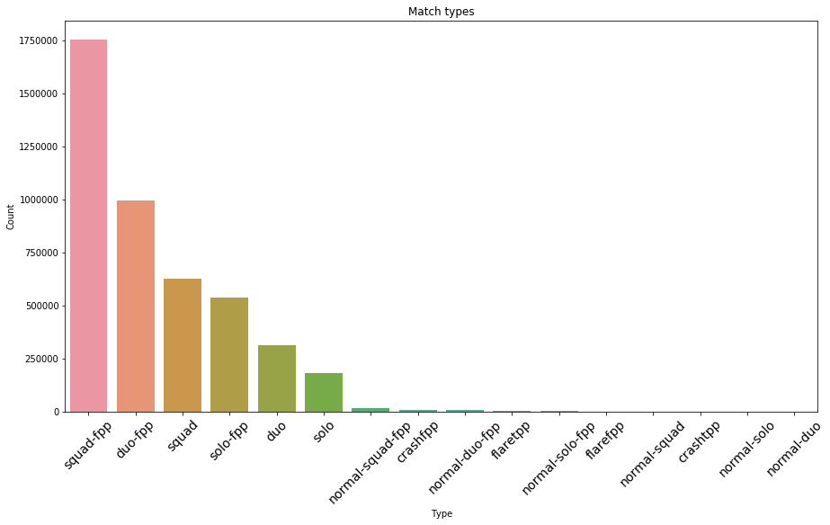


스쿼드와 듀오가 가장 인기있음을 보여줍니다. 이제 각 타입들을 세 개의 메인 카테고리로 aggregate 해보겠습니다.


```python
m_types2 = train.loc[:,"matchType"].value_counts().to_frame()
aggregated_squads = m_types2.loc[["squad-fpp","squad","normal-squad-fpp","normal-squad"],"matchType"].sum()
aggregated_duos = m_types2.loc[["duo-fpp","duo","normal-duo-fpp","normal-duo"],"matchType"].sum()
aggregated_solo = m_types2.loc[["solo-fpp","solo","normal-solo-fpp","normal-solo"],"matchType"].sum()
aggregated_mt = pd.DataFrame([aggregated_squads,aggregated_duos,aggregated_solo], index=["squad","duo","solo"], columns =["count"])
aggregated_mt
```


<div>
<style scoped>
    .dataframe tbody tr th:only-of-type {
        vertical-align: middle;
    }

    .dataframe tbody tr th {
        vertical-align: top;
    }

    .dataframe thead th {
        text-align: right;
    }
</style>
<table border="1" class="dataframe">
  <thead>
    <tr style="text-align: right;">
      <th></th>
      <th>count</th>
    </tr>
  </thead>
  <tbody>
    <tr>
      <th>squad</th>
      <td>2400402</td>
    </tr>
    <tr>
      <th>duo</th>
      <td>1315970</td>
    </tr>
    <tr>
      <th>solo</th>
      <td>720713</td>
    </tr>
  </tbody>
</table>
</div>


```python
aggregated_mt.plot.pie(y='count', legend='True', autopct='%.1f');
```


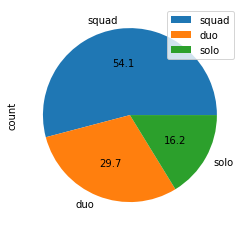


54% 이상의 매치가 스쿼드 모드에서 플레이되었음을 보여줍니다.

### b) Kills and damage dealt [^](#4) <a id="4"></a> <br>


```python
train.plot(x="kills",y="damageDealt", kind="scatter", figsize = (15,10))
plt.show()
```


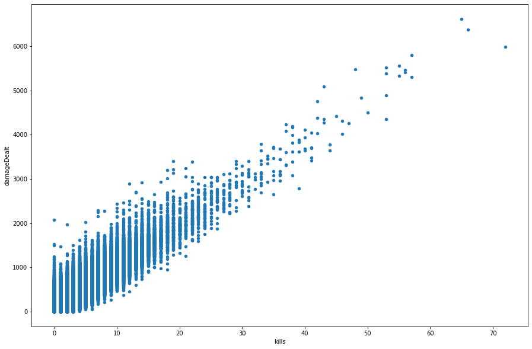


킬 수와 준 데미지에는 분명한 상관관계가 있습니다. 또한 몇몇 이상치들이 있습니다. 60킬 이상은 대다수 플레이어보다 한참 높은 수치입니다.

킬마스터들은 다음과 같습니다.


```python
train[train['kills']>60]
```


<div>
<style scoped>
    .dataframe tbody tr th:only-of-type {
        vertical-align: middle;
    }

    .dataframe tbody tr th {
        vertical-align: top;
    }

    .dataframe thead th {
        text-align: right;
    }
</style>
<table border="1" class="dataframe">
  <thead>
    <tr style="text-align: right;">
      <th></th>
      <th>Id</th>
      <th>groupId</th>
      <th>matchId</th>
      <th>assists</th>
      <th>boosts</th>
      <th>damageDealt</th>
      <th>DBNOs</th>
      <th>headshotKills</th>
      <th>heals</th>
      <th>killPlace</th>
      <th>...</th>
      <th>revives</th>
      <th>rideDistance</th>
      <th>roadKills</th>
      <th>swimDistance</th>
      <th>teamKills</th>
      <th>vehicleDestroys</th>
      <th>walkDistance</th>
      <th>weaponsAcquired</th>
      <th>winPoints</th>
      <th>winPlacePerc</th>
    </tr>
  </thead>
  <tbody>
    <tr>
      <th>334400</th>
      <td>810f2379261545</td>
      <td>7f3e493ee71534</td>
      <td>f900de1ec39fa5</td>
      <td>20</td>
      <td>0</td>
      <td>6616.0</td>
      <td>0</td>
      <td>13</td>
      <td>5</td>
      <td>1</td>
      <td>...</td>
      <td>0</td>
      <td>0.0</td>
      <td>0</td>
      <td>0.0</td>
      <td>0</td>
      <td>0</td>
      <td>1036.0</td>
      <td>60</td>
      <td>0</td>
      <td>1.0</td>
    </tr>
    <tr>
      <th>1248348</th>
      <td>80ac0bbf58bfaf</td>
      <td>1e54ab4540a337</td>
      <td>08e4c9e6c033e2</td>
      <td>5</td>
      <td>0</td>
      <td>6375.0</td>
      <td>0</td>
      <td>21</td>
      <td>4</td>
      <td>1</td>
      <td>...</td>
      <td>0</td>
      <td>0.0</td>
      <td>0</td>
      <td>0.0</td>
      <td>0</td>
      <td>0</td>
      <td>1740.0</td>
      <td>23</td>
      <td>0</td>
      <td>1.0</td>
    </tr>
    <tr>
      <th>3431247</th>
      <td>06308c988bf0c2</td>
      <td>4c4ee1e9eb8b5e</td>
      <td>6680c7c3d17d48</td>
      <td>7</td>
      <td>4</td>
      <td>5990.0</td>
      <td>0</td>
      <td>64</td>
      <td>10</td>
      <td>1</td>
      <td>...</td>
      <td>0</td>
      <td>0.0</td>
      <td>0</td>
      <td>0.0</td>
      <td>0</td>
      <td>0</td>
      <td>728.1</td>
      <td>35</td>
      <td>0</td>
      <td>1.0</td>
    </tr>
  </tbody>
</table>
<p>3 rows × 29 columns</p>
</div>


헤드샷 통계를 살펴봅시다. 헤드샷이 없는 플레이어는 필터링되었습니다.


```python
headshots = train[train['headshotKills']>0]
plt.figure(figsize=(15,5))
sns.countplot(headshots['headshotKills'].sort_values())
print("Maximum number of headshots that the player scored: " + str(train["headshotKills"].max()))
```

    Maximum number of headshots that the player scored: 64
    


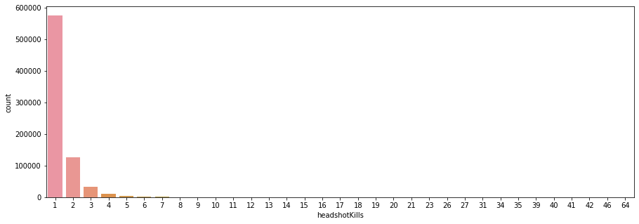


DBNO - Down But Not Out. 플레이어가 기록한 DBNO 값입니다.


```python
plt.figure(figsize=(15,5))
sns.countplot(train[train['DBNOs']>0]['DBNOs'])
print("Mean number of DBNOs that the player scored: " + str(train["DBNOs"].mean()))
```

    Mean number of DBNOs that the player scored: 0.6578755043326169
    


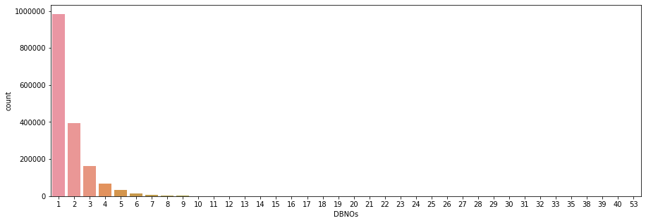


DBNO와 kill간 상관관계가 있을까요?


```python
train.plot.scatter(x='DBNOs', y='kills', figsize=(15,10));
```


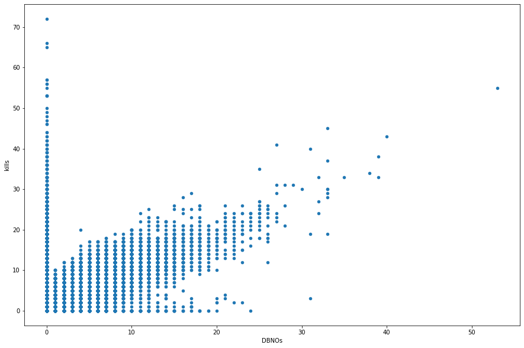


DBNO와 kill은 상관관계가 있습니다. 

### c) Maximum distances [^](#5) <a id="5"></a> <br>
범위는 합리적인 킬 거리로 필터링됩니다. 다음은 100m와 200m 조준의 예시입니다.


```python
dist = train[train['longestKill']<200]
plt.rcParams['axes.axisbelow'] = True
dist.hist('longestKill', bins=20, figsize = (15,10))
plt.show()
```


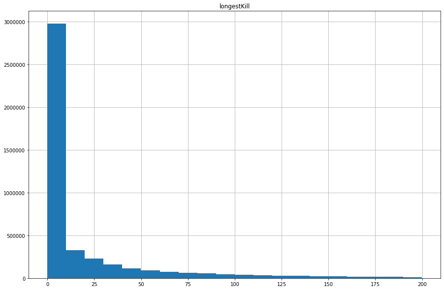


```python
print("Average longest kill distance a player achieve is {:.1f}m, 95% of them not more than {:.1f}m and a maximum distance is {:.1f}m." .format(train['longestKill'].mean(),train['longestKill'].quantile(0.95),train['longestKill'].max()))
```

    Average longest kill distance a player achieve is 23.0m, 95% of them not more than 126.1m and a maximum distance is 1094.0m.
    

1094m킬이 비현실적으로 보이지만, 8배율 스코프에 정적인 타깃, 좋은 포지션과 운이 따르면 가능합니다.


### d) Driving vs. Walking [^](#6) <a id="6"></a> <br>
걷지도 않거나 차를 몰지 않은 플레이어를 살펴본다


```python
walk0 = train["walkDistance"] == 0
ride0 = train["rideDistance"] == 0
swim0 = train["swimDistance"] == 0
print("{} of players didn't walk at all, {} players didn't drive and {} didn't swim." .format(walk0.sum(),ride0.sum(),swim0.sum()))
```

    99603 of players didn't walk at all, 3309429 players didn't drive and 4157694 didn't swim.
    

게임을 하기 위해서는 무조건 걸어야 하는데, 걷지 않은 플레이어들은 게임을 하지 않은 것일까? 


```python
walk0_rows = train[walk0]
print("Average place of non-walking players is {:.3f}, minimum is {} and the best is {}, 95% of players has a score below {}." 
      .format(walk0_rows["winPlacePerc"].mean(), walk0_rows["winPlacePerc"].min(), walk0_rows["winPlacePerc"].max(),walk0_rows["winPlacePerc"].quantile(0.95)))
walk0_rows.hist('winPlacePerc', bins=40, figsize = (15,7))
```

    Average place of non-walking players is 0.044, minimum is 0.0 and the best is 1.0, 95% of players has a score below 0.25.
    


    array([[<matplotlib.axes._subplots.AxesSubplot object at 0x000001DFACCE4550>]],
          dtype=object)


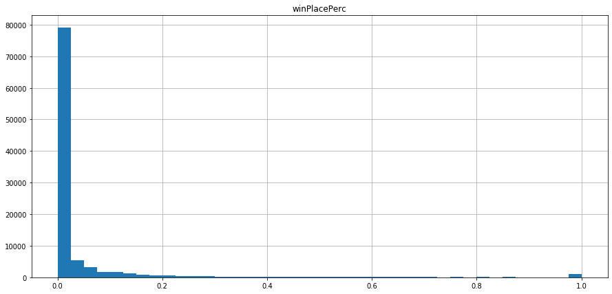


대부분의 걷지 않은 플레이어는 꼴등이다. 그러나 소수는 치킨까지 뜯었다. 이것은 개수작임이 분명하다. 의심되는 플레이어를 찾아보자.


```python
train[(train['winPlacePerc']== 1) & (train['walkDistance'] == 0)].head()
```


<div>
<style scoped>
    .dataframe tbody tr th:only-of-type {
        vertical-align: middle;
    }

    .dataframe tbody tr th {
        vertical-align: top;
    }

    .dataframe thead th {
        text-align: right;
    }
</style>
<table border="1" class="dataframe">
  <thead>
    <tr style="text-align: right;">
      <th></th>
      <th>Id</th>
      <th>groupId</th>
      <th>matchId</th>
      <th>assists</th>
      <th>boosts</th>
      <th>damageDealt</th>
      <th>DBNOs</th>
      <th>headshotKills</th>
      <th>heals</th>
      <th>killPlace</th>
      <th>...</th>
      <th>revives</th>
      <th>rideDistance</th>
      <th>roadKills</th>
      <th>swimDistance</th>
      <th>teamKills</th>
      <th>vehicleDestroys</th>
      <th>walkDistance</th>
      <th>weaponsAcquired</th>
      <th>winPoints</th>
      <th>winPlacePerc</th>
    </tr>
  </thead>
  <tbody>
    <tr>
      <th>3702</th>
      <td>3fc123559fc935</td>
      <td>5cef1df7ee3551</td>
      <td>01aead02bb8901</td>
      <td>0</td>
      <td>0</td>
      <td>0.0000</td>
      <td>0</td>
      <td>0</td>
      <td>0</td>
      <td>1</td>
      <td>...</td>
      <td>0</td>
      <td>0.0</td>
      <td>0</td>
      <td>0.0</td>
      <td>0</td>
      <td>0</td>
      <td>0.0</td>
      <td>3</td>
      <td>0</td>
      <td>1.0</td>
    </tr>
    <tr>
      <th>8790</th>
      <td>106afdb574db25</td>
      <td>4b0ae4659e9936</td>
      <td>cf0cb51c829eb5</td>
      <td>0</td>
      <td>0</td>
      <td>0.0000</td>
      <td>0</td>
      <td>0</td>
      <td>0</td>
      <td>2</td>
      <td>...</td>
      <td>0</td>
      <td>0.0</td>
      <td>0</td>
      <td>0.0</td>
      <td>0</td>
      <td>0</td>
      <td>0.0</td>
      <td>1</td>
      <td>0</td>
      <td>1.0</td>
    </tr>
    <tr>
      <th>9264</th>
      <td>0351565a7058e9</td>
      <td>3663a93a319725</td>
      <td>3659fe3694262a</td>
      <td>0</td>
      <td>0</td>
      <td>0.3218</td>
      <td>0</td>
      <td>0</td>
      <td>0</td>
      <td>1</td>
      <td>...</td>
      <td>0</td>
      <td>0.0</td>
      <td>0</td>
      <td>0.0</td>
      <td>0</td>
      <td>0</td>
      <td>0.0</td>
      <td>9</td>
      <td>0</td>
      <td>1.0</td>
    </tr>
    <tr>
      <th>18426</th>
      <td>e6d6f94558dd2f</td>
      <td>22818b9a9a6159</td>
      <td>486200c5613f14</td>
      <td>0</td>
      <td>1</td>
      <td>0.0000</td>
      <td>0</td>
      <td>0</td>
      <td>0</td>
      <td>2</td>
      <td>...</td>
      <td>0</td>
      <td>0.0</td>
      <td>0</td>
      <td>0.0</td>
      <td>0</td>
      <td>0</td>
      <td>0.0</td>
      <td>6</td>
      <td>0</td>
      <td>1.0</td>
    </tr>
    <tr>
      <th>19054</th>
      <td>d0683f5d780f09</td>
      <td>faebf5c484de4a</td>
      <td>ec9a90395ed8c0</td>
      <td>0</td>
      <td>0</td>
      <td>99.0000</td>
      <td>0</td>
      <td>0</td>
      <td>0</td>
      <td>1</td>
      <td>...</td>
      <td>0</td>
      <td>0.0</td>
      <td>0</td>
      <td>0.0</td>
      <td>0</td>
      <td>0</td>
      <td>0.0</td>
      <td>9</td>
      <td>0</td>
      <td>1.0</td>
    </tr>
  </tbody>
</table>
<p>5 rows × 29 columns</p>
</div>


```python
suspects = train.query('winPlacePerc ==1 & walkDistance ==0').head()
suspects.head()
```


<div>
<style scoped>
    .dataframe tbody tr th:only-of-type {
        vertical-align: middle;
    }

    .dataframe tbody tr th {
        vertical-align: top;
    }

    .dataframe thead th {
        text-align: right;
    }
</style>
<table border="1" class="dataframe">
  <thead>
    <tr style="text-align: right;">
      <th></th>
      <th>Id</th>
      <th>groupId</th>
      <th>matchId</th>
      <th>assists</th>
      <th>boosts</th>
      <th>damageDealt</th>
      <th>DBNOs</th>
      <th>headshotKills</th>
      <th>heals</th>
      <th>killPlace</th>
      <th>...</th>
      <th>revives</th>
      <th>rideDistance</th>
      <th>roadKills</th>
      <th>swimDistance</th>
      <th>teamKills</th>
      <th>vehicleDestroys</th>
      <th>walkDistance</th>
      <th>weaponsAcquired</th>
      <th>winPoints</th>
      <th>winPlacePerc</th>
    </tr>
  </thead>
  <tbody>
    <tr>
      <th>3702</th>
      <td>3fc123559fc935</td>
      <td>5cef1df7ee3551</td>
      <td>01aead02bb8901</td>
      <td>0</td>
      <td>0</td>
      <td>0.0000</td>
      <td>0</td>
      <td>0</td>
      <td>0</td>
      <td>1</td>
      <td>...</td>
      <td>0</td>
      <td>0.0</td>
      <td>0</td>
      <td>0.0</td>
      <td>0</td>
      <td>0</td>
      <td>0.0</td>
      <td>3</td>
      <td>0</td>
      <td>1.0</td>
    </tr>
    <tr>
      <th>8790</th>
      <td>106afdb574db25</td>
      <td>4b0ae4659e9936</td>
      <td>cf0cb51c829eb5</td>
      <td>0</td>
      <td>0</td>
      <td>0.0000</td>
      <td>0</td>
      <td>0</td>
      <td>0</td>
      <td>2</td>
      <td>...</td>
      <td>0</td>
      <td>0.0</td>
      <td>0</td>
      <td>0.0</td>
      <td>0</td>
      <td>0</td>
      <td>0.0</td>
      <td>1</td>
      <td>0</td>
      <td>1.0</td>
    </tr>
    <tr>
      <th>9264</th>
      <td>0351565a7058e9</td>
      <td>3663a93a319725</td>
      <td>3659fe3694262a</td>
      <td>0</td>
      <td>0</td>
      <td>0.3218</td>
      <td>0</td>
      <td>0</td>
      <td>0</td>
      <td>1</td>
      <td>...</td>
      <td>0</td>
      <td>0.0</td>
      <td>0</td>
      <td>0.0</td>
      <td>0</td>
      <td>0</td>
      <td>0.0</td>
      <td>9</td>
      <td>0</td>
      <td>1.0</td>
    </tr>
    <tr>
      <th>18426</th>
      <td>e6d6f94558dd2f</td>
      <td>22818b9a9a6159</td>
      <td>486200c5613f14</td>
      <td>0</td>
      <td>1</td>
      <td>0.0000</td>
      <td>0</td>
      <td>0</td>
      <td>0</td>
      <td>2</td>
      <td>...</td>
      <td>0</td>
      <td>0.0</td>
      <td>0</td>
      <td>0.0</td>
      <td>0</td>
      <td>0</td>
      <td>0.0</td>
      <td>6</td>
      <td>0</td>
      <td>1.0</td>
    </tr>
    <tr>
      <th>19054</th>
      <td>d0683f5d780f09</td>
      <td>faebf5c484de4a</td>
      <td>ec9a90395ed8c0</td>
      <td>0</td>
      <td>0</td>
      <td>99.0000</td>
      <td>0</td>
      <td>0</td>
      <td>0</td>
      <td>1</td>
      <td>...</td>
      <td>0</td>
      <td>0.0</td>
      <td>0</td>
      <td>0.0</td>
      <td>0</td>
      <td>0</td>
      <td>0.0</td>
      <td>9</td>
      <td>0</td>
      <td>1.0</td>
    </tr>
  </tbody>
</table>
<p>5 rows × 29 columns</p>
</div>


```python
print("Maximum ride distance for suspected entries is {:.3f} meters, and swim distance is {:.1f} meters." .format(suspects["rideDistance"].max(), suspects["swimDistance"].max()))
```

    Maximum ride distance for suspected entries is 0.000 meters, and swim distance is 0.0 meters.
    

흥미롭게도, 모든 이동거리가 0이다.


```python
ride = train.query('rideDistance >0 & rideDistance <10000')
walk = train.query('walkDistance >0 & walkDistance <4000')
ride.hist('rideDistance', bins=40, figsize = (15,10))
walk.hist('walkDistance', bins=40, figsize = (15,10))
plt.show()
```


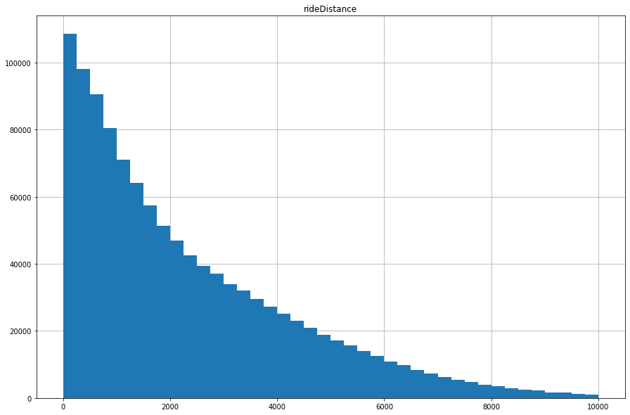


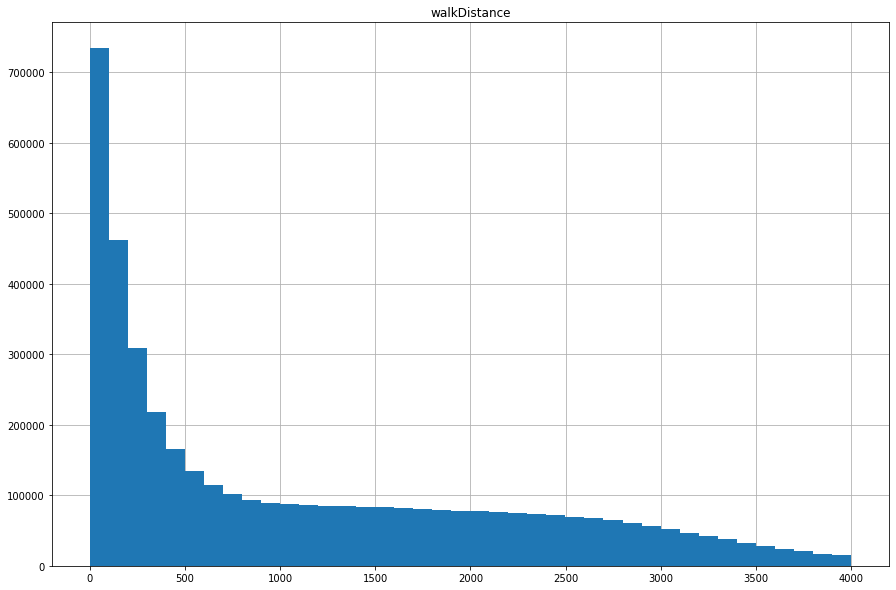


모든 이동거리를 합쳐 분포를 살펴보자.


```python
travel_dist = train["walkDistance"] + train["rideDistance"] + train["swimDistance"]
travel_dist = travel_dist[travel_dist<5000]
travel_dist.hist(bins=40, figsize = (15,10))
```


    <matplotlib.axes._subplots.AxesSubplot at 0x1e026a1ea58>


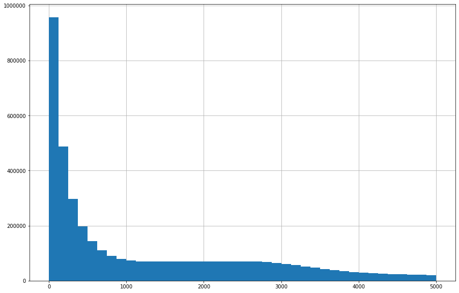


### e) Weapons acquired [^](#7) <a id="7"></a> <br>


```python
print("Average number of acquired weapons is {:.3f}, minimum is {} and the maximum {}, 99% of players acquired less than weapons {}." 
      .format(train["weaponsAcquired"].mean(), train["weaponsAcquired"].min(), train["weaponsAcquired"].max(), train["weaponsAcquired"].quantile(0.99)))
train.hist('weaponsAcquired', figsize = (20,10),range=(0, 10), align="left", rwidth=0.9)
```

    Average number of acquired weapons is 3.660, minimum is 0 and the maximum 236, 99% of players acquired less than weapons 10.0.
    


    array([[<matplotlib.axes._subplots.AxesSubplot object at 0x000001E0182E1630>]],
          dtype=object)


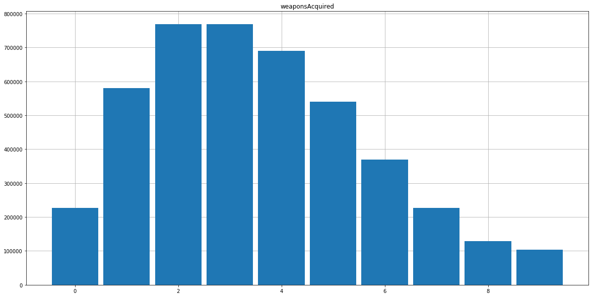


### f) Correlation map [^](#8) <a id="8"></a> <br>


```python
plt.figure(figsize=(20,15))
sns.heatmap(train.corr(), annot=True)
```


    <matplotlib.axes._subplots.AxesSubplot at 0x1e0244f56a0>


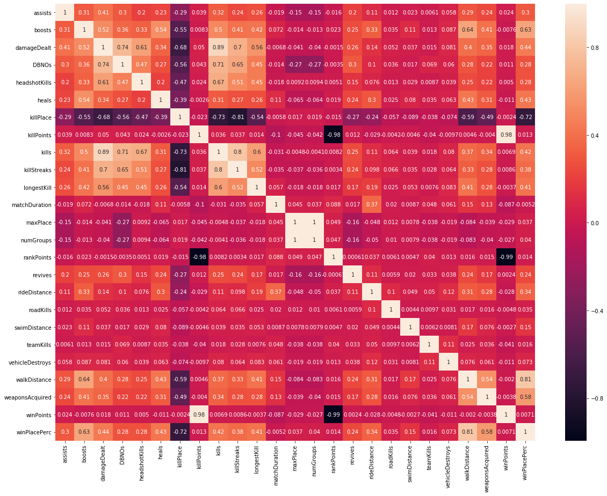


```python
ax = sns.clustermap(train.corr(), annot=True, linewidths=.6, fmt= '.2f', figsize=(20, 15))
plt.show()
```


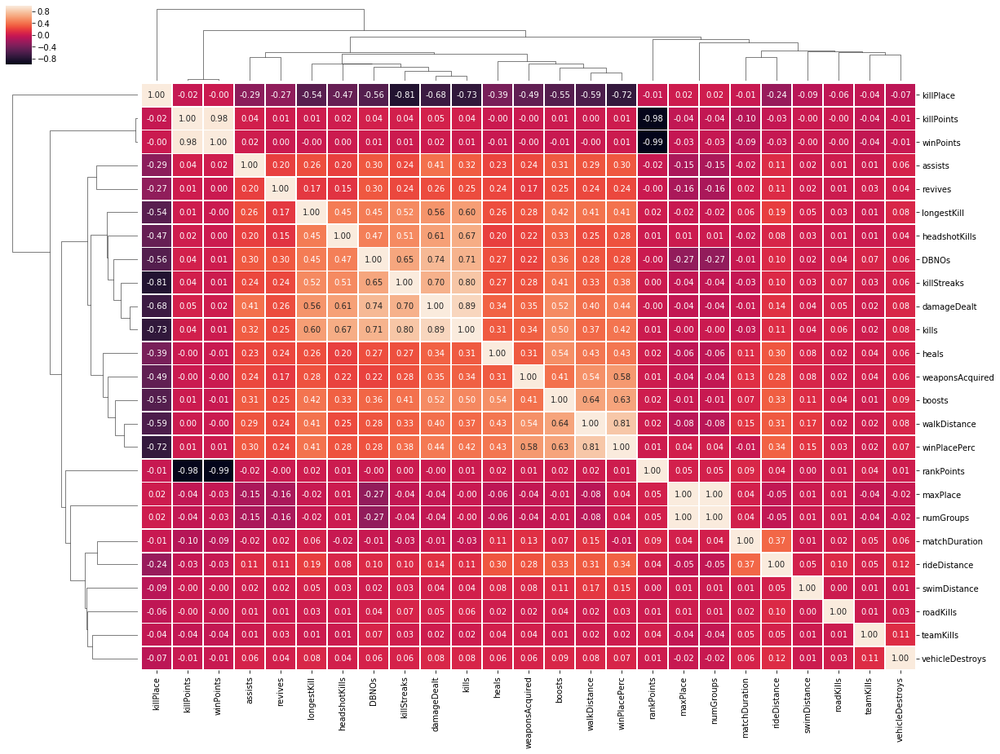


## 3-Analysis of TOP 10% of players [^](#9) <a id="9"></a> <br>


```python
top10 = train[train["winPlacePerc"]>0.9]
print("TOP 10% overview\n")
print("Average number of kills: {:.1f}\nMinimum: {}\nThe best: {}\n95% of players within: {} kills." 
      .format(top10["kills"].mean(), top10["kills"].min(), top10["kills"].max(),top10["kills"].quantile(0.95)))

top10.plot(x="kills", y="damageDealt", kind="scatter", figsize = (15,10))
```

    TOP 10% overview
    
    Average number of kills: 2.6
    Minimum: 0
    The best: 72
    95% of players within: 8.0 kills.
    


    <matplotlib.axes._subplots.AxesSubplot at 0x1e037457278>


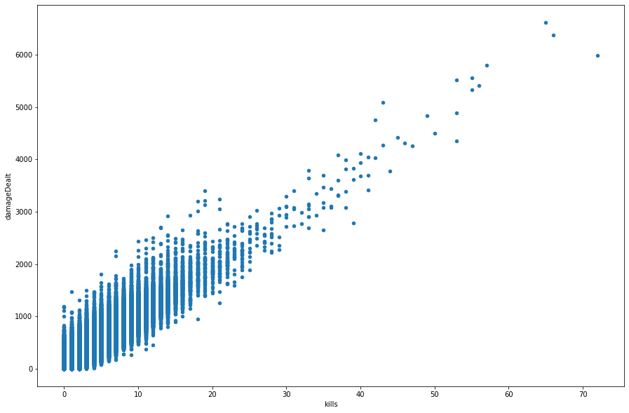


이동거리를 전체 플레이어와 비교하며 살펴보자.


```python
fig, ax1 = plt.subplots(figsize = (15,10))
walk.hist('walkDistance', bins=40, figsize = (15,10), ax = ax1)
walk10 = top10[top10['walkDistance']<5000]
walk10.hist('walkDistance', bins=40, figsize = (15,10), ax = ax1)

print("Average walking distance: " + str(top10['walkDistance'].mean()))
```

    Average walking distance: 2813.5134925205784
    


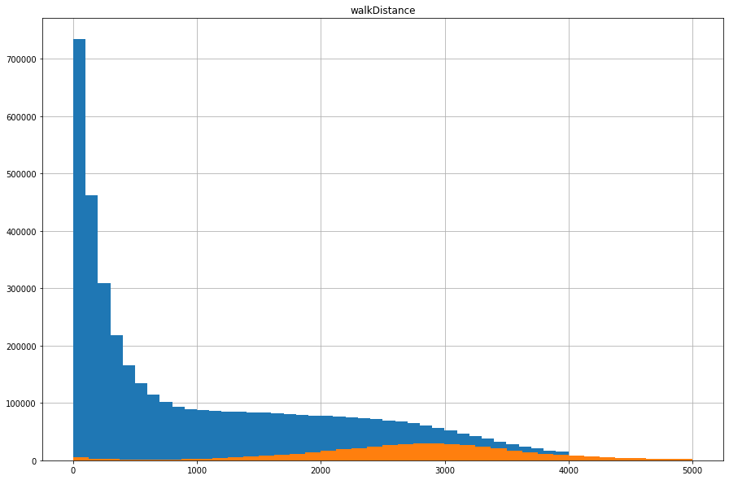


```python
fig, ax1 = plt.subplots(figsize = (15,10))
ride.hist('rideDistance', bins=40, figsize = (15,10), ax = ax1)
ride10 = top10.query('rideDistance >0 & rideDistance <10000')
ride10.hist('rideDistance', bins=40, figsize = (15,10), ax = ax1)
print("Average riding distance: " + str(top10['rideDistance'].mean()))
```

    Average riding distance: 1392.0857815081788
    


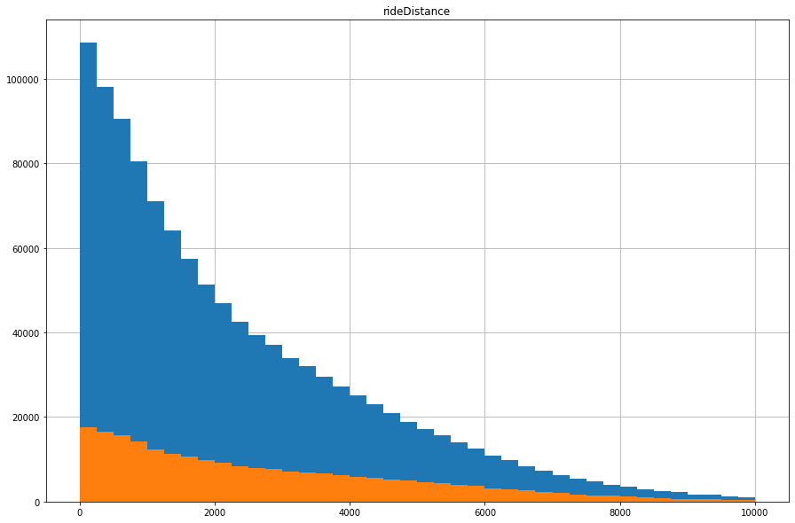


가장 멀리서 죽인 거리는 얼마일까?


```python
print("On average the best 10% of players have the longest kill at {:.3f} meters, and the best score is {:.1f} meters." .format(top10["longestKill"].mean(), top10["longestKill"].max()))
```

    On average the best 10% of players have the longest kill at 75.048 meters, and the best score is 1094.0 meters.
    

변수 간 상관관계를 살펴보자


```python
ax = sns.clustermap(top10.corr(), annot=True, linewidths=.5, fmt= '.2f', figsize=(20, 15))
plt.show()
```


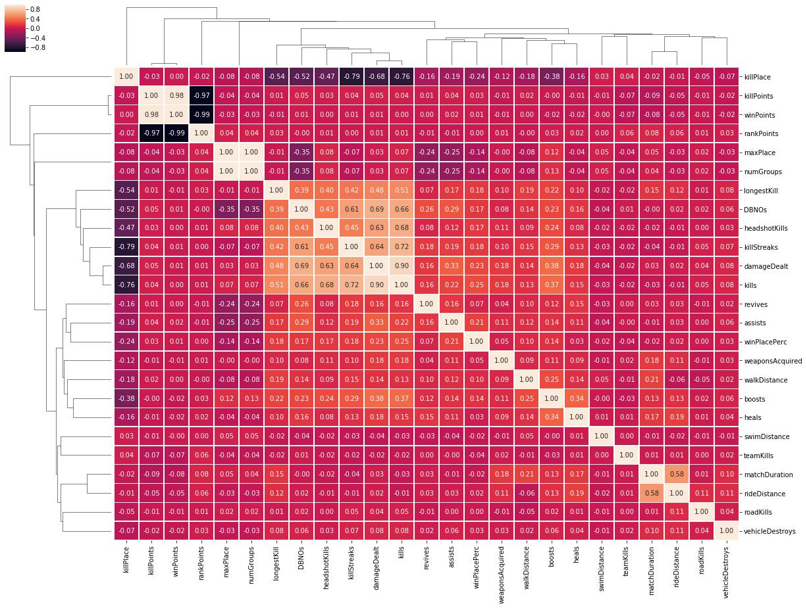

