> 시계열 데이터 분석 연습을 위한 캐글 노트북 따라하기.
> [원본 노트북](https://www.kaggle.com/kanncaa1/time-series-prediction-tutorial-with-eda)

# INTRODUCTION
<a href="http://ibb.co/hxXdKx"></a>

이 커널에서는 **aerial bombing  operations** 과 **weather conditions in world war 2** 데이터를 사용합니다. 순서는 다음과 같습니다. 시계열 예측에는 **ARIMA** 를 사용할 것입니다.
 
* [Load the Data](#1)
* [Data Description](#2)
* [Data Cleaning](#3)
* [Data Visualization](#4)
* [Time Series Prediction with ARIMA](#5)
    * [ What is Time Series ?](#6)
    * [Stationarity of a Time Series](#7)
    * [Make a Time Series Stationary](#8)
        * Moving Average method
        * Differencing method
    * [Forecasting a Time Series](#9)
* [Conclusion](#10)


```python
import numpy as np # linear algebra
import pandas as pd # data processing, CSV file I/O (e.g. pd.read_csv)
import seaborn as sns # visualization library
import matplotlib.pyplot as plt # visualization library

# Input data files are available in the "../input/" directory.
# For example, running this (by clicking run or pressing Shift+Enter) will list the files in the input directory
import os
print(os.listdir("./input"))
import warnings            
warnings.filterwarnings("ignore") # if there is a warning after some codes, this will avoid us to see them.
plt.style.use('ggplot') # style of plots. ggplot is one of the most used style, I also like it.
# Any results you write to the current directory are saved as output.
```

    ['operations.csv', 'Summary of Weather.csv', 'Weather Station Locations.csv']
    

<a id="1"></a> <br>
## Load the Data
* Aerial Bombing Operations in WW2
    * 2차 세계대전 폭격 작전에 대한 데이터. 
* Wether Conditions in WW2
    * 2차 세계대전의 날씨 데이터
    * 데이터셋은 날씨 관측소의 위치(나라, 경도, 위도)와
    * 최소,최대 중간 온도에 관한 측정값으로 이루어져 있다.


```python
# bombing data
aerial = pd.read_csv("./input/operations.csv")
# first weather data that includes locations like country, latitude and longitude.
weather_station_location = pd.read_csv("./input/Weather Station Locations.csv")
# Second weather data that includes measured min, max and mean temperatures
weather = pd.read_csv("./input/Summary of Weather.csv")
```

<a id="2"></a> <br>
## Data Description
커널에서 사용할 피쳐만 설명한다.
* **Aerial bombing Data description:**
    * Mission Date: Date of mission
    * Theater of Operations: Region in which active military operations are in progress; "the army was in the field awaiting action"; Example: "he served in the Vietnam theater for three years"
    * Country: Country that makes mission or operation like USA
    * Air Force: Name or id of air force unity like 5AF
    * Aircraft Series: Model or type of aircraft like B24
    * Callsign: Before bomb attack, message, code, announcement, or tune that is broadcast by radio.
    * Takeoff Base: Takeoff airport name like Ponte Olivo Airfield 
    * Takeoff Location: takeoff region Sicily
    * Takeoff Latitude: Latitude of takeoff region
    * Takeoff Longitude: Longitude of takeoff region
    * Target Country: Target country like Germany
    * Target City: Target city like Berlin
    * Target Type: Type of target like city area
    * Target Industry: Target industy like town or urban
    * Target Priority: Target priority like 1 (most)
    * Target Latitude: Latitude of target 
    * Target Longitude: Longitude of target
* **Weather Condition data description:**
    * Weather station location:
        * WBAN: Weather station number
        * NAME: weather station name
        * STATE/COUNTRY ID: acronym of countries
        * Latitude: Latitude of weather station
        * Longitude: Longitude of weather station
    * Weather:
        * STA: eather station number (WBAN)
        * Date: Date of temperature  measurement 
        * MeanTemp: Mean temperature


```python
aerial.head()
```


<div>
<style scoped>
    .dataframe tbody tr th:only-of-type {
        vertical-align: middle;
    }

    .dataframe tbody tr th {
        vertical-align: top;
    }

    .dataframe thead th {
        text-align: right;
    }
</style>
<table border="1" class="dataframe">
  <thead>
    <tr style="text-align: right;">
      <th></th>
      <th>Mission ID</th>
      <th>Mission Date</th>
      <th>Theater of Operations</th>
      <th>Country</th>
      <th>Air Force</th>
      <th>Unit ID</th>
      <th>Aircraft Series</th>
      <th>Callsign</th>
      <th>Mission Type</th>
      <th>Takeoff Base</th>
      <th>...</th>
      <th>Incendiary Devices Weight (Tons)</th>
      <th>Fragmentation Devices</th>
      <th>Fragmentation Devices Type</th>
      <th>Fragmentation Devices Weight (Pounds)</th>
      <th>Fragmentation Devices Weight (Tons)</th>
      <th>Total Weight (Pounds)</th>
      <th>Total Weight (Tons)</th>
      <th>Time Over Target</th>
      <th>Bomb Damage Assessment</th>
      <th>Source ID</th>
    </tr>
  </thead>
  <tbody>
    <tr>
      <th>0</th>
      <td>1</td>
      <td>8/15/1943</td>
      <td>MTO</td>
      <td>USA</td>
      <td>12 AF</td>
      <td>27 FBG/86 FBG</td>
      <td>A36</td>
      <td>NaN</td>
      <td>NaN</td>
      <td>PONTE OLIVO AIRFIELD</td>
      <td>...</td>
      <td>NaN</td>
      <td>NaN</td>
      <td>NaN</td>
      <td>NaN</td>
      <td>NaN</td>
      <td>NaN</td>
      <td>10.0</td>
      <td>NaN</td>
      <td>NaN</td>
      <td>NaN</td>
    </tr>
    <tr>
      <th>1</th>
      <td>2</td>
      <td>8/15/1943</td>
      <td>PTO</td>
      <td>USA</td>
      <td>5 AF</td>
      <td>400 BS</td>
      <td>B24</td>
      <td>NaN</td>
      <td>1</td>
      <td>NaN</td>
      <td>...</td>
      <td>NaN</td>
      <td>NaN</td>
      <td>NaN</td>
      <td>NaN</td>
      <td>NaN</td>
      <td>NaN</td>
      <td>20.0</td>
      <td>NaN</td>
      <td>NaN</td>
      <td>9366.0</td>
    </tr>
    <tr>
      <th>2</th>
      <td>3</td>
      <td>8/15/1943</td>
      <td>MTO</td>
      <td>USA</td>
      <td>12 AF</td>
      <td>27 FBG/86 FBG</td>
      <td>A36</td>
      <td>NaN</td>
      <td>NaN</td>
      <td>PONTE OLIVO AIRFIELD</td>
      <td>...</td>
      <td>NaN</td>
      <td>NaN</td>
      <td>NaN</td>
      <td>NaN</td>
      <td>NaN</td>
      <td>NaN</td>
      <td>9.0</td>
      <td>NaN</td>
      <td>NaN</td>
      <td>NaN</td>
    </tr>
    <tr>
      <th>3</th>
      <td>4</td>
      <td>8/15/1943</td>
      <td>MTO</td>
      <td>USA</td>
      <td>12 AF</td>
      <td>27 FBG/86 FBG</td>
      <td>A36</td>
      <td>NaN</td>
      <td>NaN</td>
      <td>PONTE OLIVO AIRFIELD</td>
      <td>...</td>
      <td>NaN</td>
      <td>NaN</td>
      <td>NaN</td>
      <td>NaN</td>
      <td>NaN</td>
      <td>NaN</td>
      <td>7.5</td>
      <td>NaN</td>
      <td>NaN</td>
      <td>NaN</td>
    </tr>
    <tr>
      <th>4</th>
      <td>5</td>
      <td>8/15/1943</td>
      <td>PTO</td>
      <td>USA</td>
      <td>5 AF</td>
      <td>321 BS</td>
      <td>B24</td>
      <td>NaN</td>
      <td>1</td>
      <td>NaN</td>
      <td>...</td>
      <td>NaN</td>
      <td>NaN</td>
      <td>NaN</td>
      <td>NaN</td>
      <td>NaN</td>
      <td>NaN</td>
      <td>8.0</td>
      <td>NaN</td>
      <td>NaN</td>
      <td>22585.0</td>
    </tr>
  </tbody>
</table>
<p>5 rows × 46 columns</p>
</div>


<a id="3"></a> <br>
## Data Cleaning
* Aerial  Bombing data는 많은 NaN 값이 있다. 사용하는 대신 몇몇 NaN 값을 drop한다. 불확실성을 없애고 시각화를 쉽게 해 준다.
    * Drop countries that are NaN
    * Drop if target longitude is NaN
    * Drop if takeoff longitude is NaN
    * Drop unused features
* Weather Condition data는 정제가 필요없다. EDA를 통해 특정 장소를 정하고 깊게 살펴본다. 사용할 변수만 남기도록 합니다.


```python
# drop countries that are NaN
aerial.dropna(subset=['Country'], inplace=True)
# drop if target longitude is NaN
aerial.dropna(subset=['Target Longitude'], inplace=True)
# Drop if takeoff longitude is NaN
aerial.dropna(subset=['Takeoff Longitude'], inplace=True)
# drop unused features
drop_list = ['Mission ID','Unit ID','Target ID','Altitude (Hundreds of Feet)','Airborne Aircraft',
             'Attacking Aircraft', 'Bombing Aircraft', 'Aircraft Returned',
             'Aircraft Failed', 'Aircraft Damaged', 'Aircraft Lost',
             'High Explosives', 'High Explosives Type','Mission Type',
             'High Explosives Weight (Pounds)', 'High Explosives Weight (Tons)',
             'Incendiary Devices', 'Incendiary Devices Type',
             'Incendiary Devices Weight (Pounds)',
             'Incendiary Devices Weight (Tons)', 'Fragmentation Devices',
             'Fragmentation Devices Type', 'Fragmentation Devices Weight (Pounds)',
             'Fragmentation Devices Weight (Tons)', 'Total Weight (Pounds)',
             'Total Weight (Tons)', 'Time Over Target', 'Bomb Damage Assessment','Source ID']
aerial.drop(columns=drop_list, inplace=True)

aerial = aerial[ aerial.iloc[:,8]!="4248"] # drop this takeoff latitude 
aerial = aerial[ aerial.iloc[:,9]!=1355]   # drop this takeoff longitude
```


```python
aerial.info()
```

    <class 'pandas.core.frame.DataFrame'>
    Int64Index: 2555 entries, 0 to 178080
    Data columns (total 17 columns):
    Mission Date             2555 non-null object
    Theater of Operations    2555 non-null object
    Country                  2555 non-null object
    Air Force                2505 non-null object
    Aircraft Series          2528 non-null object
    Callsign                 10 non-null object
    Takeoff Base             2555 non-null object
    Takeoff Location         2555 non-null object
    Takeoff Latitude         2555 non-null object
    Takeoff Longitude        2555 non-null float64
    Target Country           2499 non-null object
    Target City              2552 non-null object
    Target Type              602 non-null object
    Target Industry          81 non-null object
    Target Priority          230 non-null object
    Target Latitude          2555 non-null float64
    Target Longitude         2555 non-null float64
    dtypes: float64(3), object(14)
    memory usage: 359.3+ KB
    


```python
# what we will use only
weather_station_location = weather_station_location[["WBAN","NAME","STATE/COUNTRY ID","Latitude","Longitude"]]
weather_station_location.info()
```

    <class 'pandas.core.frame.DataFrame'>
    RangeIndex: 161 entries, 0 to 160
    Data columns (total 5 columns):
    WBAN                161 non-null int64
    NAME                161 non-null object
    STATE/COUNTRY ID    161 non-null object
    Latitude            161 non-null float64
    Longitude           161 non-null float64
    dtypes: float64(2), int64(1), object(2)
    memory usage: 6.4+ KB
    


```python
# what we will use only
weather = weather[["STA","Date","MeanTemp"]]
weather.info()
```

    <class 'pandas.core.frame.DataFrame'>
    RangeIndex: 119040 entries, 0 to 119039
    Data columns (total 3 columns):
    STA         119040 non-null int64
    Date        119040 non-null object
    MeanTemp    119040 non-null float64
    dtypes: float64(1), int64(1), object(1)
    memory usage: 2.7+ MB
    

<a id="4"></a> <br>
## Data Visualization
* 어떤 나라가 공격했는가
* 가장 많이 공격당한 나라
* Top 10 항공기
* 이륙 위치(Attack countries)
* 타겟 위치
* 폭파 경로
* Theater of Operations
* 날씨 관측소 위치


```python
aerial['Country'].value_counts()
```


    USA              1895
    GREAT BRITAIN     544
    NEW ZEALAND       102
    SOUTH AFRICA       14
    Name: Country, dtype: int64


```python
plt.figure(figsize=(10,5))
sns.countplot(aerial['Country']);
```


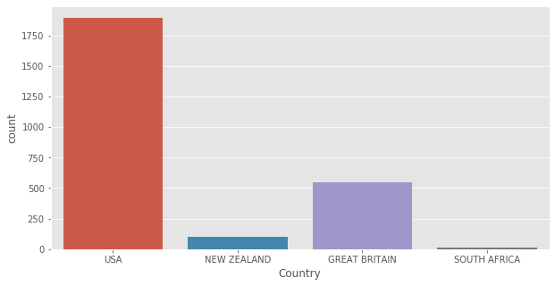


```python
# Top target countries
print(aerial['Target Country'].value_counts()[:10])
plt.figure(figsize=(22,10))
sns.countplot(aerial['Target Country'])
plt.xticks(rotation=90)
plt.show()
```

    ITALY      1104
    BURMA       335
    LIBYA       272
    TUNISIA     113
    GREECE       87
    EGYPT        80
    JAPAN        71
    CHINA        52
    SICILY       46
    GERMANY      41
    Name: Target Country, dtype: int64
    


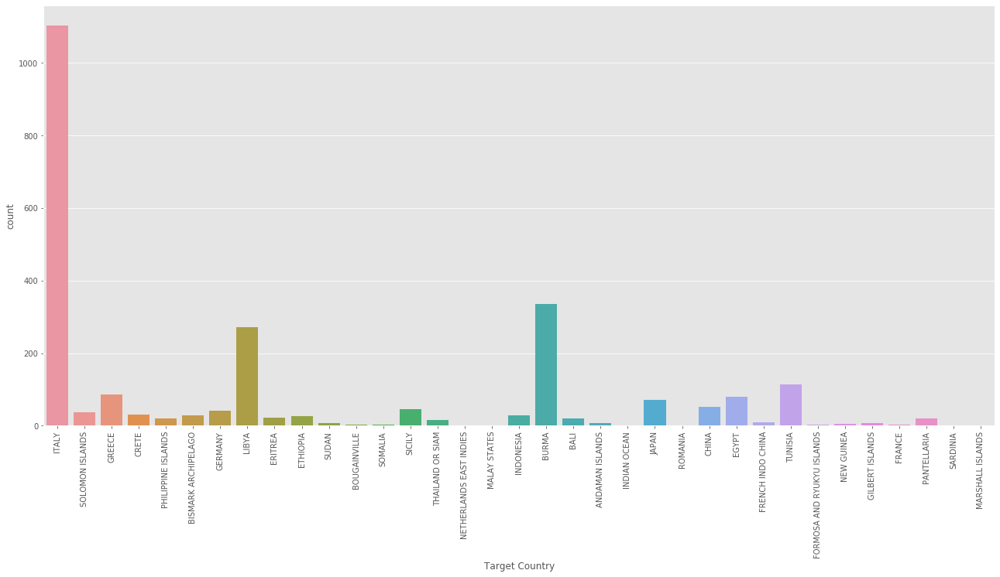


```python
data = aerial['Aircraft Series'].value_counts()
plt.figure(figsize=(12,5))
sns.barplot(data[:10].index, data[:10].values)
```


    <matplotlib.axes._subplots.AxesSubplot at 0x1cb003a71d0>


**Most used air craft: A36**
<a href="http://imgbb.com/"></a>


```python
#Theater of Operations
plt.figure(figsize=(12,5))
sns.countplot(aerial['Theater of Operations']);
```


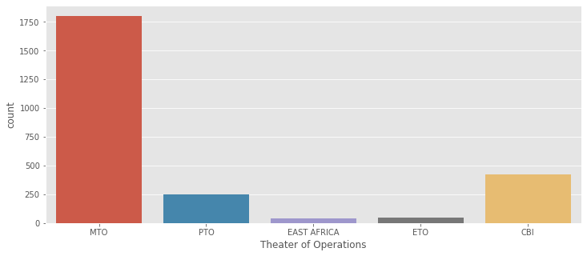


**USA and BURMA 전쟁**에서 1942년부터 1945 까지 미국은 폭격을 가했다. 가장 가까운 날씨 관측소는 **BINDUKURI** 이고 1943부터 1945까지 날씨 기록을 가지고 있다. 시각화하기 전에 날짜 특성을 DateTime 객체로 바꾸자.


```python
bindu = weather_station_location[weather_station_location['NAME'] == 'BINDUKURI']
```


```python
weather.Date = weather.Date.astype('datetime64')
```


```python
bindu_weather = weather[weather['STA'] == int(bindu['WBAN'])]
```


```python
bindu_weather.set_index('Date', inplace=True)
```


```python
bindu_weather['MeanTemp'].plot(title='Mean Temp of Bindukuri Area', legend=True, figsize=(12,5))
```


    <matplotlib.axes._subplots.AxesSubplot at 0x1cb0050f470>


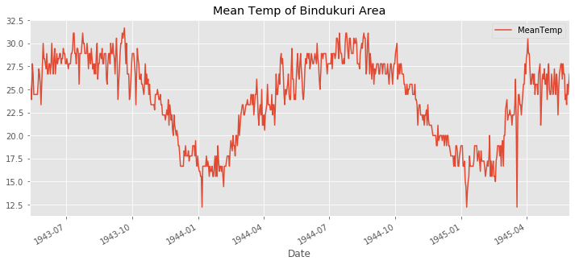


```python
aerial = pd.read_csv('./input/operations.csv')
```


```python
aerial['Mission Date'] = aerial['Mission Date'].astype('datetime64')
```


```python
aerial['year'] = aerial['Mission Date'].astype('datetime64').apply(lambda x:x.year)
```


```python
aerial['month'] = aerial['Mission Date'].astype('datetime64').apply(lambda x:x.month)
```


```python
aerial = aerial[(aerial['year'] >= 1943) & (aerial['month']>= 8) ]
```


```python
attack = "USA"
target = "BURMA"
city = "KATHA"

aerial_war = aerial[aerial.Country == attack]
aerial_war = aerial_war[aerial_war["Target Country"] == target]
aerial_war = aerial_war[aerial_war["Target City"] == city]
```


```python
bindu_weather.reset_index(inplace=True)
```


```python
aerial_war.rename(columns={'Mission Date':'Date'}, inplace=True)
```


```python
joined = bindu_weather.merge(aerial_war[['Date']], on='Date').drop_duplicates()
```


```python
plt.figure(figsize=(12,5))
sns.scatterplot(x='Date', y='MeanTemp',color='blue', data=joined[['Date', 'MeanTemp']], label='Bomb').set(xlim=(bindu_weather.Date.iloc[0], bindu_weather.Date.iloc[-1]));
sns.lineplot(x='Date', y='MeanTemp',data=bindu_weather);
```


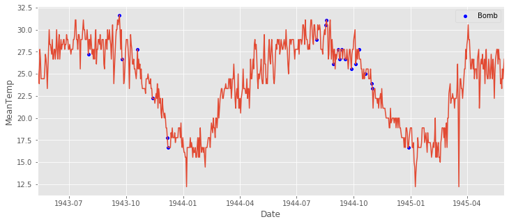


<a id="5"></a> <br>
## Time Series Prediction with ARIMA
* ARIMA : AutoRegressive Integrated Moving Average.

<a id="6"></a> <br>
### What is time series?
일정한 시간 간격을 두고 수집된 데이터 포인트들의 집합이고, 시간 의존적이다. 대부분의 시계열은 계절성을 띄고 있다. 예를 들어, 아이스크림은 여름에 잘 팔릴 것이다. 하지만, 주사위의 숫자 6이 여름에 더 나오지는 않을 것이다. 이는 계절성이 없는 경우이다.

<a id="7"></a> <br>
### Stationarity of a Time Series
시계열이 stationary series인지 아닌지 구분하는 3가지의 기본 기준이 있다. 평균, 분산과 같은 통계적 특성들이 시간이 지나도 일정해야 한다. 
1. 일정한 평균
2. 일정한 분산
3. 시간에 영향을 받지 않는 자기 공분산. 자기 공분산은 시계열과 lagged 시계열 간의 공분산이다.

시각화해서 계절성을 확인해 보자.


```python
# Mean temperature of Bindikuri area
bindu_weather.set_index('Date')['MeanTemp'].plot(figsize=(12,5));
plt.legend();
```


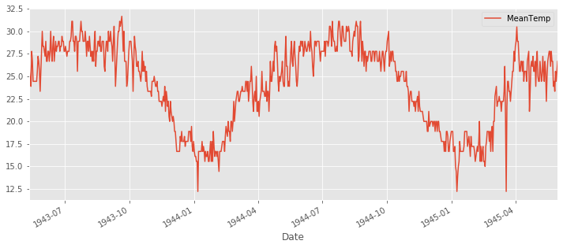


```python
ts = bindu_weather.set_index('Date')['MeanTemp']
```

위의 시계열 데이터는 계절성을 띔을 볼 수 있다. 다음 방법으로 stationary를 살펴보자.
- plotting rolling statistics : window size를 6으로 하여 rolling mean과 variance를 살펴본다.
- Dickey-Fuller Test : 시험 결과는 테스트 통계와 다른 레벨의 주요 값으로 이루어진다. 테스트 통계가 주요 값보다 작으면 시계열이 stationary 하다고 한다.


```python
plt.figure(figsize=(12,5))
ts.plot(label='Original', legend=True)
ts.rolling(6).mean().plot(legend=True, label='rolling_mean')
ts.rolling(6).std().plot(legend=True, label='rolling_std')
```


    <matplotlib.axes._subplots.AxesSubplot at 0x1cb190cde10>


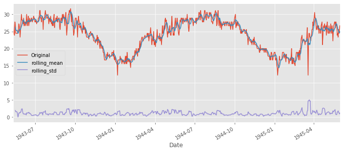


```python
# adfuller library 
from statsmodels.tsa.stattools import adfuller
# check_adfuller
# Dickey-Fuller test
result = adfuller(ts, autolag='AIC')
print('Test statistic: ' , result[0])
print('p-value: '  ,result[1])
print('Critical Values:' ,result[4])

```

    Test statistic:  -1.4095966745887747
    p-value:  0.577666802852636
    Critical Values: {'1%': -3.439229783394421, '5%': -2.86545894814762, '10%': -2.5688568756191392}
    

1. stationay의 첫번째 기준은 일정한 평균이다. 평균이 일정하지 않기 때문에 stationary하지 않다.
2. 일정한 분산을 가지기 때문에 stationary하다.
3. 시험 통계량이 주요 값보다 작지 않기에 stationary하지 않다.

<a id="8"></a> <br>
### Make a Time Series Stationary?
이전에 봤던 것처럼 계절성이 없는 2가지 근거는
1. 경향 : 시간에 따라 다른 평균값. 시계열에서 일정한 평균은 stationary의 근거이다.
2. 계절성 : 특정 시간의 분산. 시계열에서 일정한 분산은 stationary의 근거이다.

trend(constant mean) 문제를 해결하기 위해 moving average 방법을 사용한다. 이전 'n'개의 윈도우 샘플의 평균으로 구한다.


```python
ts.plot()
ts.rolling(6).mean().plot(figsize=(12,5))
```


    <matplotlib.axes._subplots.AxesSubplot at 0x1cb19d6b630>


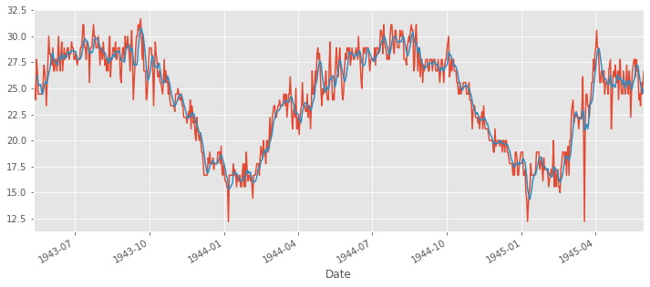


```python
ts_moving_avg_diff = ts - ts.rolling(6).mean()
ts_moving_avg_diff.dropna(inplace=True) # first 6 is nan value due to window size

plt.figure(figsize=(12,5))
ts_moving_avg_diff.plot(label='Original', legend=True)
ts_moving_avg_diff.rolling(6).mean().plot(legend=True, label='rolling_mean')
ts_moving_avg_diff.rolling(6).std().plot(legend=True, label='rolling_std')
```


    <matplotlib.axes._subplots.AxesSubplot at 0x1cb1a314278>


```python
result = adfuller(ts_moving_avg_diff, autolag='AIC')
print('Test statistic: ' , result[0])
print('p-value: '  ,result[1])
print('Critical Values:' ,result[4])
```

    Test statistic:  -11.138514335138474
    p-value:  3.150868563164652e-20
    Critical Values: {'1%': -3.4392539652094154, '5%': -2.86546960465041, '10%': -2.5688625527782327}
    

1. Constant mean criteria:평균이 일정하다. (yes stationary)
2. constant variance. 분산이 일정하다.. (yes stationary)
3. 시험 통계량이 1%의 유의 값보다 작다.따라서 99%의 신뢰도를 가지고 stationart 하다.

경향과 계절성을 살펴보는 한 가지 방법이 더 있다. 
- Differencing method : 시계열과 shifted 시계열의 차이를 본다.


```python
# differencing method
ts_diff = ts - ts.shift()
plt.figure(figsize=(12,5))
ts_diff.plot()
```


    <matplotlib.axes._subplots.AxesSubplot at 0x1cb1a3858d0>


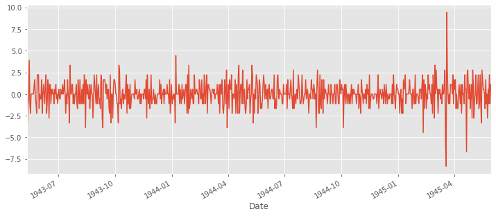


```python
ts_diff.dropna(inplace=True) # due to shifting there is nan values
# check stationary: mean, variance(std)and adfuller test
plt.figure(figsize=(12,5))
ts_diff.plot(label='Diff', legend=True)
ts_diff.rolling(6).mean().plot(legend=True, label='mean')
ts_diff.rolling(6).std().plot(legend=True, label='std')


result = adfuller(ts_diff, autolag='AIC')
print('Test statistic: ' , result[0])
print('p-value: '  ,result[1])
print('Critical Values:' ,result[4])
```

    Test statistic:  -11.678955575105366
    p-value:  1.760207569355997e-21
    Critical Values: {'1%': -3.439229783394421, '5%': -2.86545894814762, '10%': -2.5688568756191392}
    


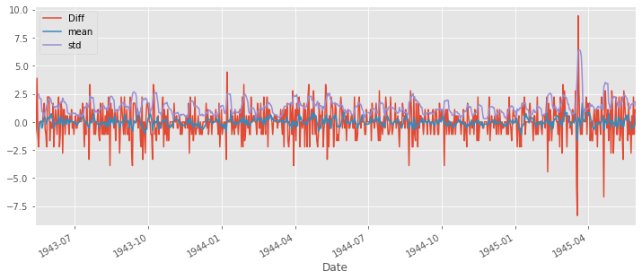


일정한 분산, 일정한 평균, 1%유의수준으로 99% 신뢰도를 가지는 stationart series이다.

<a id="9"></a> <br>
### Forecasting a Time Series
moving average와 differncing 방법으로 주기와 계절성 문제를 해결했다. 

예측을 위해서는 differencing 방법의 시계열을 사용하겠다. 이유는 딱히 없다.

ARIMA를 예측 방법으로 사용할 것이다.
1. AR - Auto_Regressive : lag가 다를 변수들을 사용한다. 3을 쓸 것이다.
2. I - Intergrated : 비계절성 차이의 수이다. 여기서는 첫번째 순서의 차이를 사용할 것이므로 d=0이다.
3. MA - Moving Averages : 예측 방정식에서 lagged된 예측 에러이다.

(p,d,q) ARIMA 모델의 파라미터이다. 파라미터를 선정하기 위해 두 개의 플롯을 사용할 것이다.

1. Autocorrelation Function (ACF): 시계열과 lagged 시계열의 상관관계 수치이다.
2. Partial Autocorrelation Function (PACF): 시계열과 lagged 시계열의 상관관계 수치이다. intervening comparisons에 의해 설명된 변수는 제거되었다.


```python
# ACF and PACF 
from statsmodels.tsa.stattools import acf, pacf
lag_acf = acf(ts_diff, nlags=20)
lag_pacf = pacf(ts_diff, nlags=20, method='ols')
# ACF
plt.figure(figsize=(12,5))

plt.subplot(121) 
plt.plot(lag_acf)
plt.axhline(y=0,linestyle='--',color='gray')
plt.axhline(y=-1.96/np.sqrt(len(ts_diff)),linestyle='--',color='gray')
plt.axhline(y=1.96/np.sqrt(len(ts_diff)),linestyle='--',color='gray')
plt.title('Autocorrelation Function')

# PACF
plt.subplot(122)
plt.plot(lag_pacf)
plt.axhline(y=0,linestyle='--',color='gray')
plt.axhline(y=-1.96/np.sqrt(len(ts_diff)),linestyle='--',color='gray')
plt.axhline(y=1.96/np.sqrt(len(ts_diff)),linestyle='--',color='gray')
plt.title('Partial Autocorrelation Function')
plt.tight_layout()
```


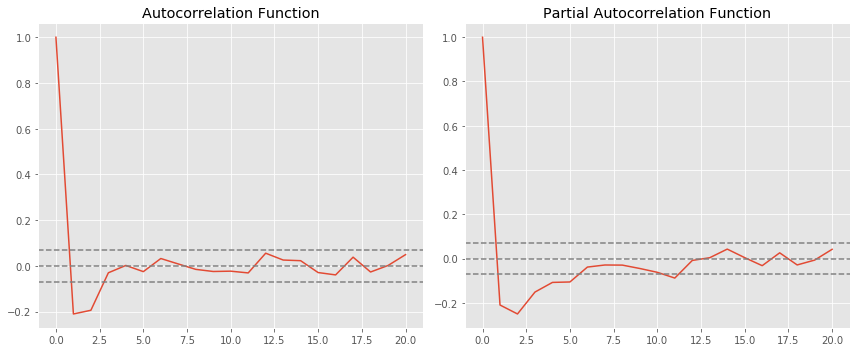


* 두 점선은 신뢰구간으로, p와 q를 정할 때 사용된다.
    * Choosing p: PACF차트가 위의 신뢰구간을 가로지를 때의 lag 값. p=1
    * Choosing q: ACF차트가 위의 신뢰구간을 가로지를 때의 lag 값. q=1
* 이제 (1, 0, 1)을 파라미터로 하여 ARIMA로 예측 분석을 한다.
    * ARIMA: statsmodel 라이브러리에 있다.
    * datetime: predict 함수의 시작과 끝 인덱스로 사용한다.


```python
# ARIMA LİBRARY
from statsmodels.tsa.arima_model import ARIMA
from pandas import datetime

# fit model
model = ARIMA(ts, order=(1,0,1)) # (ARMA) = (1,0,1)
model_fit = model.fit(disp=0)

# predict
start_index = datetime(1944, 6, 25)
end_index = datetime(1945, 5, 31)
forecast = model_fit.predict(start=start_index, end=end_index)

# visualization
plt.figure(figsize=(12,5))
plt.plot(bindu_weather.Date,bindu_weather.MeanTemp,label = "original")
plt.plot(forecast,label = "predicted")
plt.title("Time Series Forecast")
plt.xlabel("Date")
plt.ylabel("Mean Temperature")
plt.legend()
plt.show()
```


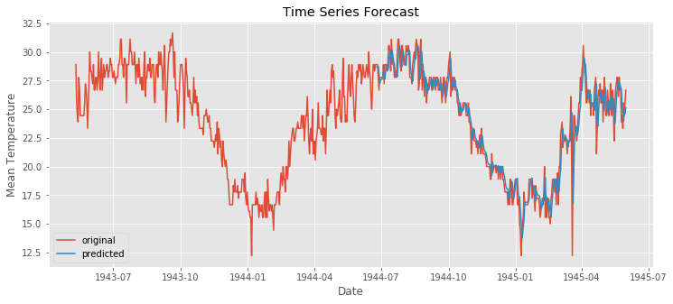


전체 날짜를 예측하고 MSE를 구해 보자.


```python
# predict all path
from sklearn.metrics import mean_squared_error
# fit model
model2 = ARIMA(ts, order=(1,0,1)) # (ARMA) = (1,0,1)
model_fit2 = model2.fit(disp=0)
forecast2 = model_fit2.predict()
error = mean_squared_error(ts, forecast2)
print("error: " ,error)
# visualization
plt.figure(figsize=(12,5))
plt.plot(bindu_weather.Date,bindu_weather.MeanTemp,label = "original")
plt.plot(forecast2,label = "predicted")
plt.title("Time Series Forecast")
plt.xlabel("Date")
plt.ylabel("Mean Temperature")
plt.legend()
plt.savefig('graph.png')

plt.show()
```

    error:  1.8625823047996397
    


